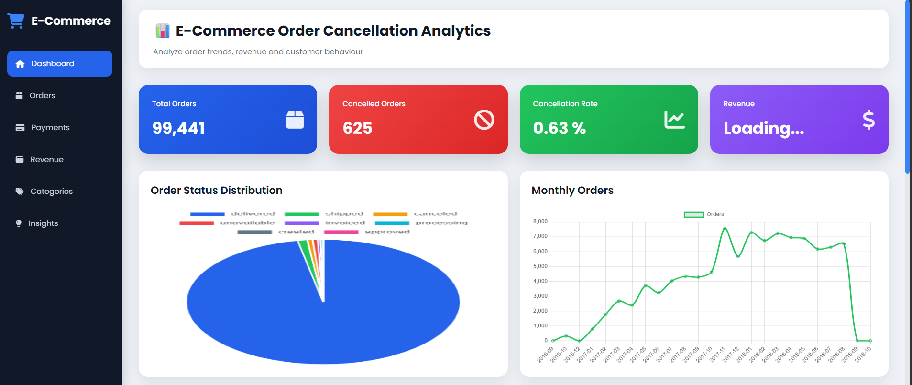
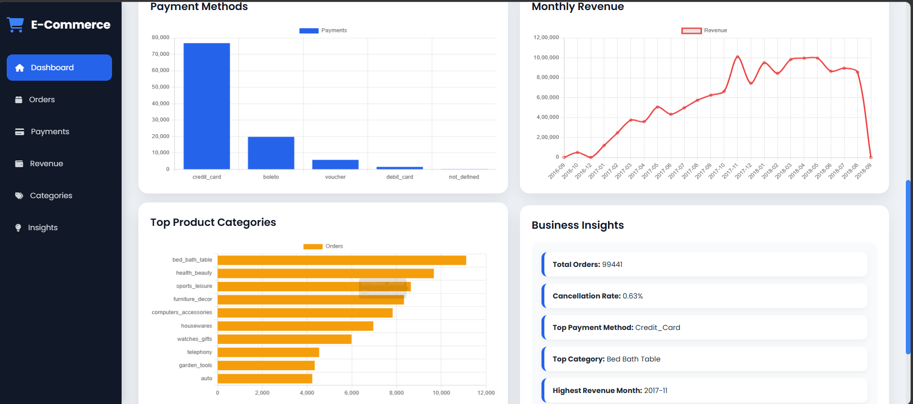

# E-Commerce Cancellation Analysis Dashboard

A data analytics dashboard built using **FastAPI, Pandas, SQLite, and Chart.js** to analyze e-commerce order data and visualize business insights like cancellations, payments, and sales trends.

---

## Features

- Total orders and cancellation tracking
-  Order status distribution (Pie chart)
-  Payment method analysis (Bar chart)
-  Monthly order trends (Line chart)
-  Top product categories analysis
-  Business insights dashboard
-  Interactive UI using Chart.js

---

## Tech Stack

- Python
- FastAPI
- Pandas
- SQLite
- HTML, CSS, JavaScript
- Chart.js

---

## Dataset

This project uses the **Olist Brazilian E-Commerce dataset** containing:
- Orders
- Payments
- Products
- Customers
- Sellers

---

## Dashboard Preview

### Main Dashboard


### Analytics View


---

## Project Structure

```text id="structure"
ecommerce-dashboard/
│
├── app.py
├── analysis.py
├── database.py
├── requirements.txt
│
├── data/
│
├── screenshots/
│   ├── dashboard1.png
│   └── dashboard2.png
│
├── static/
│   ├── script.js
│   └── style.css
│
├── templates/
│   └── index.html
